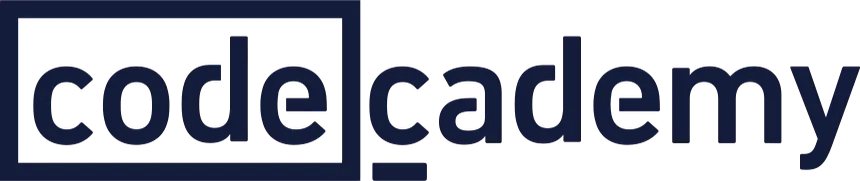

# CodeAcademy Computer Science Path Projects

Welcome to my CodeAcademy Computer Science Path repository! 🚀

This repository contains my solutions and projects as I progress through the CodeAcademy Computer Science Path. Each project is designed to reinforce key programming concepts and problem-solving skills using Python.

## 📂 Project List
- **Receipts for Lovely Loveseats**
- **Magic 8 Ball**
- **Sal's Shipping**

## 🌟 About This Path
The CodeAcademy Computer Science Path is a comprehensive journey through the fundamentals of computer science, including:
- Intro to Programming
- Fundamentals of Python
- loading...
- loading...

---

Feel free to explore and fork!

---

**Happy Coding!**
